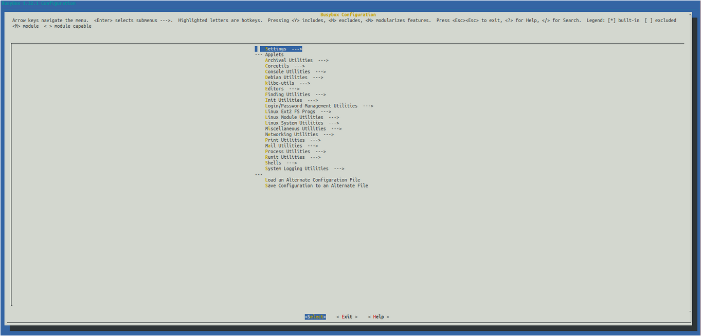

## Busybox compilation:
The installation path is set to ./busybox_rootfs.

Set environment variables:
```
export KERNEL_FOLDER=/home/user/linux-${KERNEL_VER}
export KERNEL_OBJ=$KERNEL_FOLDER/obj
export BUSYBOX_VER=1.32.1
export INITRAMFS_IGZ=$KERNEL_OBJ/initramfs.igz
```

Download Busybox from URL:
```
curl https://busybox.net/downloads/busybox-${BUSYBOX_VER}.tar.bz2 | tar jxf -
cd busybox-${BUSYBOX_VER}
mkdir out
make O=./out defconfig
```

Configure parameters:
```
cat .config|grep DEBUG_INFO
CONFIG_DEBUG_INFO=y
# CONFIG_DEBUG_INFO_REDUCED is not set
# CONFIG_DEBUG_INFO_COMPRESSED is not set
CONFIG_DEBUG_INFO_SPLIT=y
CONFIG_DEBUG_INFO_DWARF4=y
```

Make configuration:
```
make defconfig
make menuconfig
```

Change additional configurations:
```
sed -i 's/# CONFIG_STATIC is not set/CONFIG_STATIC=y/' .config
sed -i 's/CONFIG_DMALLOC=y/CONFIG_DMALLOC=n/g' .config
make
make CONFIG_PREFIX=./busybox_rootfs install
```

Create the filesystem structure:
```
mkdir -p initramfs/{bin,dev,etc,home,mnt,proc,sys,usr}
```

Copy busybox build files:
```
cp -r busybox_rootfs/* initramfs/
```

Create a directory for kernel modules which should be loaded automatically:
```
mkdir initramfs/modules
```

Create init script, that will be executed during start:
```
touch initramfs/init
vim initramfs/init
```

Add the following:
```
#!/bin/sh
# mount filesystems
mount -t proc none /proc
mount -t sysfs none /sys

### load the kernel modules
for i in `find modules -iname "*.ko"`
do
    	insmod /modules/$i
done
mdev -s 	# make device files available

# start shell with root privileges
# exec /bin/sh

# start sh with uid 1000 and without root privileges
setuidgid 1000 sh
```

Add execution permission to init:

```
chmod +x initramfs/init
```


Pack the initramfs directory to a cpio archive:
```
cd initramfs
find . -print0 | cpio --null -ov --format=newc > ../initramfs.cpio
gzip ../initramfs.cpio
```





 